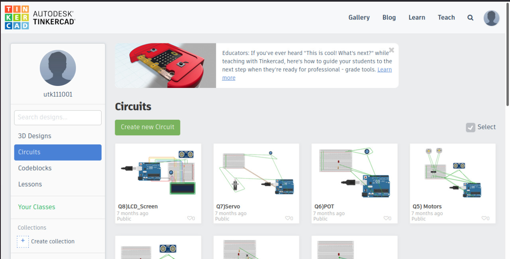
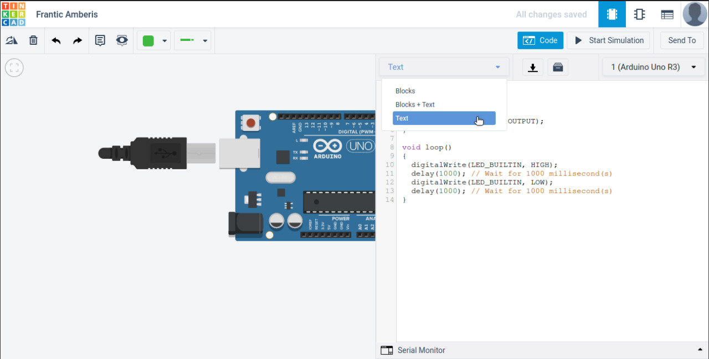

# Arduino

## Your task is as follows:

1. Design the circuit for a simple differential wheeled robot on tinkerCAD ( just use an Arduino, 2 DC motors, and a battery pack ). Also, complete the boiler script to program the motors such that it follows the integer array of directions  (The array of directions will be hard-coded in the Arduino script by you). Consider ideal conditions (both the motors are exactly the same, no slipping of wheels, etc.), and the distance between the centers of two grids is 1 meter. Use only digital HIGH/LOW on the motors which will cause the robot to move at the speed of 1 m/s. The distance between the two wheels is also 1 meter. 

Go to https://www.tinkercad.com and sign up.

You will be taken to your dashboard. Select “3D circuit” from the list to the left and then create a new Circuit.

Create the required circuit by dragging the required components to the middle of the screen.

After inserting the Arduino board into the circuit, the option to write your code will be available. 

Click on the code button.

From the drop-down list select “Text”.

Program the Arduino in accordance with the problem statement.

Now you should be able to test your circuit by clicking on “Start Simulation”.

## RESOURCES

To learn the basics of Arduino, you can refer to this:
https://www.youtube.com/playlist?list=PLA567CE235D39FA84
(First  6 videos should be enough to cover the basics )  

You can learn about Differential Drive Robots over here:
https://youtu.be/aE7RQNhwnPQ 
(Just try to apply what you learn from here to try and rotate the bot left or right, about its own center ) 

# Control systems 

2. your task is to tune a PID controller for a quadcopter vertical takeoff in a matlab simulated environment

## Resources
to learn about PID control algoritms , you can refer to this playlist:
https://www.youtube.com/watch?v=wkfEZmsQqiA&list=PLn8PRpmsu08pQBgjxYFXSsODEF3Jqmm-y
(Just try to apply what you learn from here)

The code base is as follows:

[?] controller.m - Controller for a quadrotor.

runsim.m - Test script to be called for testing.

height_control.m - Simulation code that will be called by runsim.

fixed_set_point.m - Step response function.

utils - Helper functions for quadrotor simulator

? indicates files you will need to implement

You will need to first implement a PD controller for height control of the quadrotor. Then,
tune the proportional gain (Kp) ,derivative gain (Kv) and the integral gain (Ki) in the file controller.m until the
quadrotor converges quickly and smoothly to a step response input.

`😃 We know that the task looks overwhelming but try to do as much as you can, not compulasory to finish it all but try to do perfectly whichever part you are going to complete  😃  ` 